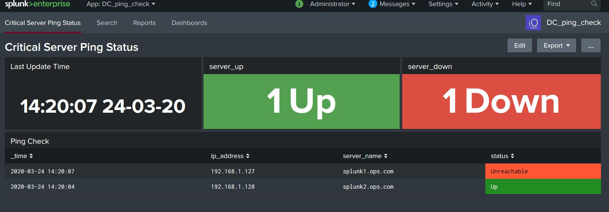

Ping Check 

This apps provides basic ping check information.

Its design to check on a small number of CRITICAL servers, so you can use this with the free version of Splunk and it wont cost anything. You can also use it in a production enviroment, but keep servers numbers below the 25 mark. (Otherwise you will need to adjust the polling time, which can be done in the cron job settings)

The ping check is designed to run every 10 minutes, this is fine as sometimes you will reboot servers, but any that do go offline, you will see the status in the dashboard.

Dashboard Features:

- Last Update Time
- Server Up
- Server Down
- Ping Check Status

Application Features:

- KV Store used for faster response - shows table status

Data Config:
csv data
data kept for 7 days
index=ping
index size = 200MB

Script for Data:-

The app uses a python script to ping the servers, this will then output to a csv file which is monitoried by the inputs and data is ingested.

Files:

- ./bin/scripts/dc_ping_server_v0.4.py #This is used to ping the servers
- ./data/output_status.csv #This is used to output the ping results
- ./data/servers.csv #This is used to add the target servers that will be pinged

Install:

    Download the zip and extract the file, copy the DC_ping_check folder to the Splunk Server
    sudo cp -R DC_ping_check /opt/splunk/etc/apps
    sudo chown -R splunk:splunk /opt/splunk/etc/apps
    sudo -u splunk /opt/splunk/bin/splunk restart

Config:

The indexes and sourcetype will be created, see inputs, props and transforms.

The ping runs every 10 minutes, data is saved into the output_status.csv file, a saved search pipes this data into the ping collections kvstore.  

- index=ping
- sourcetype = ping_csv

Add the servers into the servers.csv file.

Run crontab -e (as user Splunk) and add the below
*/10 * * * * /opt/splunk/bin/splunk cmd python3 /opt/splunk/etc/apps/DC_ping_check/bin/scripts/dc_ping_server_v0.4.py

Use:
Login to Splunk and go DC_ping_check app and select dashboards, you should see the you should see data 